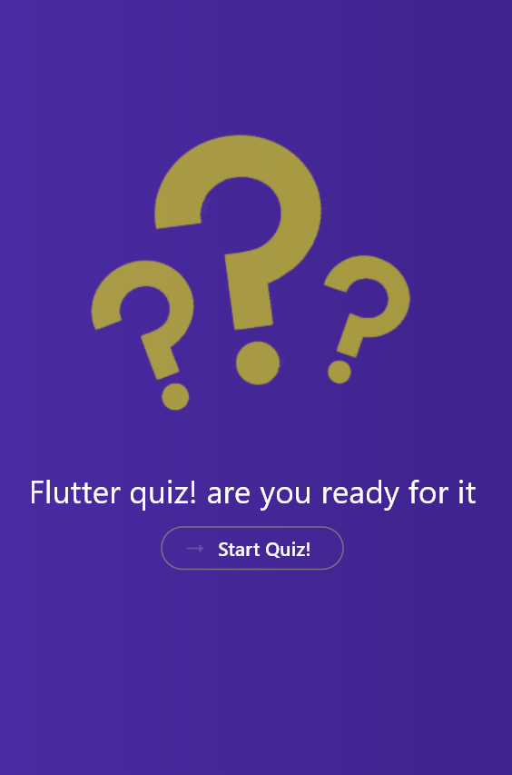
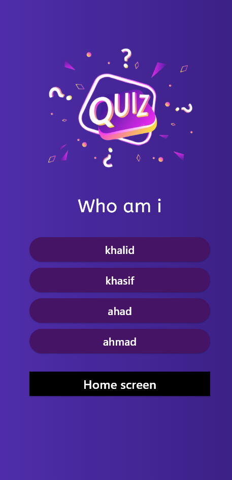

# Flutter Application 1

A new Flutter project showcasing the power and flexibility of Flutter to build modern, cross-platform mobile applications.

---

## 🚀 Features

- **Cross-Platform**: Runs seamlessly on Android, iOS, and more.
- **Customizable**: Designed as a starting point for creating unique applications.
- **Extensive Resources**: Learn Flutter with the helpful links below.

---

## 📸 Screenshots

### Home Screen


### Another Feature Screen


---

## 🛠️ Getting Started

This project serves as a boilerplate for new Flutter developers. 

Here are some resources to guide you:

- [Lab: Write your first Flutter app](https://docs.flutter.dev/get-started/codelab)
- [Cookbook: Useful Flutter samples](https://docs.flutter.dev/cookbook)

### Prerequisites

Ensure you have the following installed:
- Flutter SDK
- Dart
- Android Studio/VS Code

---

## 💻 How to Run

1. Clone the repository:
   ```bash
   git clone <repository-url>
